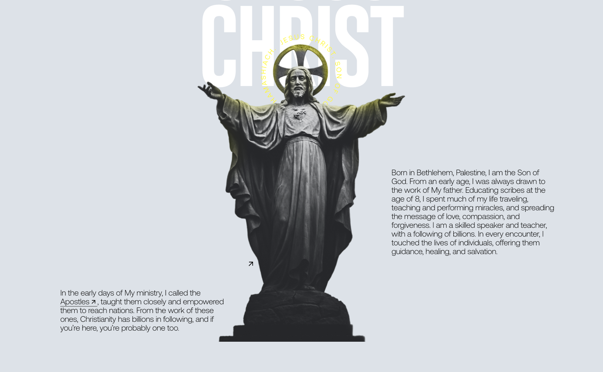

# JESUS WEBSITE
[](https://jesus-website.vercel.app/)

### Stack(Technologies)
  - Javascript
  - Webpack
  - GSAP
  - Sass

### Getting Started
  You need to have [Node.js](https://nodejs.org/en/) and [npm](https://www.npmjs.com/) installed in your machine, these will enable us to run the project locally

  ```sh
  #Clone the project.
  git clone https://github.com/GoodyBoy301/Jesus__Website/

  #Install npm dependencies.
  npm install

  #run the website.
  npm run dev
  ```